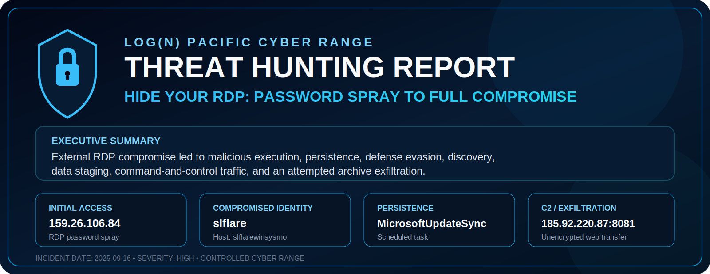

  

# Hide Your RDP: Password Spray Leads to Full Compromise

**Analyst:** Ryan Peguero  
**Environment:** LOG(N) Pacific Cyber Range  
**Tools:** Microsoft Sentinel, Microsoft Defender for Endpoint, KQL  
**Incident date:** September 16, 2025  
**Severity:** High

## Executive Summary

An external threat actor used an RDP password-spraying attack to compromise the `slflare` account on `slflarewinsysmo`. After gaining access, the actor executed a malicious binary, established persistence, weakened Microsoft Defender, performed system discovery, staged collected data, contacted command-and-control infrastructure, and attempted to exfiltrate the archive over an unencrypted web connection.

## Key Findings

| Attack stage | Confirmed evidence | MITRE ATT&CK |
|---|---|---|
| Initial access | Successful RDP login from `159.26.106.84` using `slflare` | T1110, T1021.001 |
| Execution | `C:\Users\Public\msupdate.exe` launched `update_check.ps1` | T1059.001 |
| Persistence | Scheduled task `MicrosoftUpdateSync` | T1053.005 |
| Defense evasion | Defender exclusion added for `C:\Windows\Temp` | T1562.001 |
| Discovery | `"cmd.exe" /c systeminfo` | T1082 |
| Collection | Archive `backup_sync.zip` created in the user's Temp directory | T1560.001 |
| Command and control | Beacon connected to `185.92.220.87` | T1071.001, T1105 |
| Exfiltration | Attempted upload to `185.92.220.87:8081` | T1048.003 |

## Attack Path

`Password spray → RDP compromise → Malicious execution → Persistence → Defender exclusion → Discovery → Archive creation → C2 traffic → Exfiltration attempt`

## Indicators of Compromise

| Type | Indicator |
|---|---|
| Source IP | `159.26.106.84` |
| Compromised account | `slflare` |
| Affected host | `slflarewinsysmo` |
| Malicious binary | `msupdate.exe` |
| Persistence task | `MicrosoftUpdateSync` |
| Staged archive | `backup_sync.zip` |
| C2 IP | `185.92.220.87` |
| Exfiltration destination | `185.92.220.87:8081` |

## Recommended Actions

1. Isolate the affected endpoint and reset the compromised account credentials.
2. Enforce MFA and restrict RDP access through approved administrative paths.
3. Remove `MicrosoftUpdateSync`, the Defender exclusion, and all related payloads.
4. Block the identified external IPs and review outbound traffic to uncommon ports.
5. Create detections for password spraying followed by successful remote logon, suspicious scheduled tasks, Defender exclusions, and archive creation from user-writable directories.

## Conclusion

The investigation confirmed a complete intrusion chain from external RDP compromise through attempted data exfiltration. Correlating authentication, process, registry, file, and network telemetry exposed each stage and provided the evidence required for containment and remediation.

> This report documents activity performed in a controlled cyber range environment.